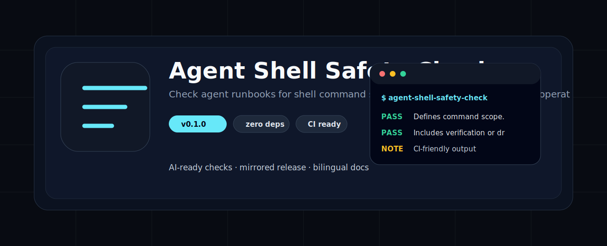
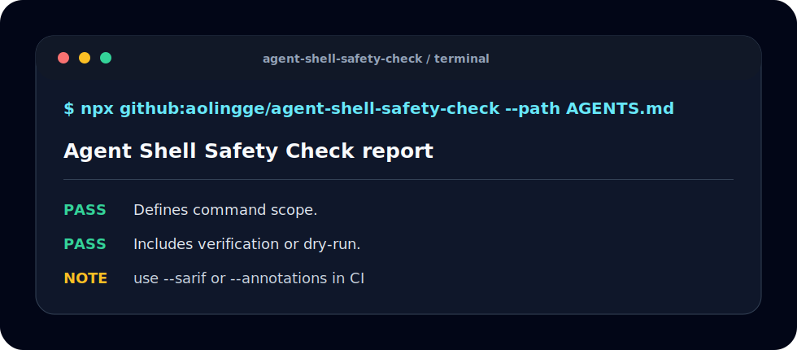

<p align="center">
  
</p>

<h1 align="center">Agent Shell Safety Check</h1>

<p align="center">Check agent runbooks for shell command scope, verification, and destructive-operation boundaries.</p>

<p align="center"><a href="README.zh-CN.md">中文</a> · <a href="#quick-start">Quick Start</a> · <a href="#checks">Checks</a> · <a href="#ci-usage">CI</a></p>

<p align="center">
  
  
  
</p>

<p align="center">
  
</p>

## Why This Exists

AI-agent workflows keep growing, but many repositories still miss tiny local checks that are easy to repeat in CI. This tool stays zero-dependency, mirror-friendly, and easy to fork.

## Quick Start

```bash
npx github:aolingge/agent-shell-safety-check --path AGENTS.md
```

```bash
npx github:aolingge/agent-shell-safety-check --path AGENTS.md --markdown > report.md
npx github:aolingge/agent-shell-safety-check --path AGENTS.md --sarif > results.sarif
npx github:aolingge/agent-shell-safety-check --path AGENTS.md --annotations
```

## Checks

| Check | What it looks for |
| --- | --- |
| scope | Defines command scope. |
| verify | Includes verification or dry-run. |
| destructive | Names destructive operations. |
| approval | Requires confirmation for risky commands. |

## CI Usage

See [docs/github-actions.md](docs/github-actions.md) and [docs/quality-gates.md](docs/quality-gates.md).

## Mirrors

- GitHub: https://github.com/aolingge/agent-shell-safety-check
- Gitee: https://gitee.com/aolingge/agent-shell-safety-check

## Contributing

Good first PRs: add checks, add fixtures, improve docs, or add GitHub Actions examples.

## License

MIT
